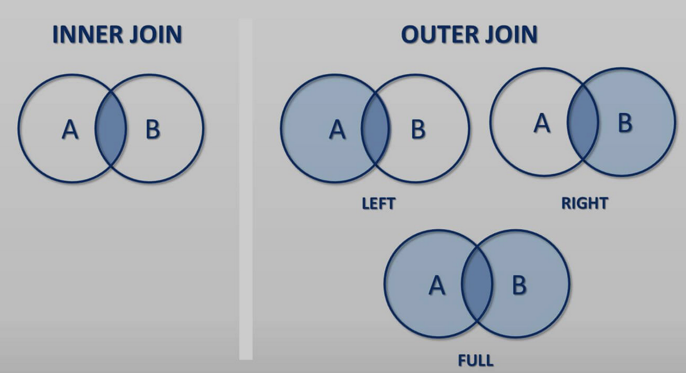

# COMPLETE SQL-MASTERCLASS

Notes to the Online-Course 'Die komplette SQL Masterclass: Vom Anfänger zum Profi' - https://www.udemy.com/course/sql-komplett/

# (1) Introduction
This course covers the two databank-systems 'MySQL' & 'PostgreSQL' - both are commonly used frameworks with only small differences.  
- MySQL:  
	- Less Features than PostgreSQL   
	- often part of WebHosters  

- PostgreSQL:  
	- more features than MySQL   
	- ideal for complex queries  

There is SQL-Tool available online: https://downloads.codingcoursestv.eu/043%20-%20sql/online-sql/dist/index.html

**Exemplary Query:**  
Select the columns "id", "creator", "title" & "downloads" from the table "books" where "creator" equals ''Niemann, August'.  

		SELECT "id", "creator", "title", "downloads"
		FROM books
		WHERE creator = 'Niemann, August'

# (2) Installation of PostgreSQL
As MySQL doesn't work on MacOS, I've only set-up PostgreSQL.   

- Download of a databank *(s. 'data/')*
- Configuration of PostgreSQL
	- PGAdmin4 
	- Servers
	- Creation of new data-base

# (3) Databank Queries
## SELECT
Select columns from a data-base.   
- Optimally, put colnames in " " *(' ' doesn't work)*  
- Case-Sensitive

Select all columns from data-base// only columns A, B from TABLE 

	SELECT * FROM TABLE			
	SELECT "A", "B" FROM TABLE

## WHERE 
Select rows that full-fill a condition.   
- Mathematically: >, <, >=, <=
- Equal/ Unequal: =, <>
- AND, OR
	- in brackets: ... WHERE ("name" = 'Alex' AND "gender" = 'M' AND "year" = 2010)
- NOT:
	- in brackets: ... WHERE NOT("age" > 20) 
- Put strings in ' ' *(" " doesn't work)*
 
Get all columns for the rows, where title = 'Hr. Dr'// 'Fr. Dr' & where AGE > 30

	SELECT * 
	FROM TABLE
	WHERE (TITLE = 'Fr. Dr.' OR TITLE = 'Hr. Dr') AND	
		AGE > 30  							

## COUNT & DISTINCT
- 'COUNT' counts the amount of rows
- 'DISTINCT' shows all unique values of a column  
	- use brackets over multiple columns 
	- PostgreSQL differs between a - ä, ... + CaseSensitive *(MySQL not!)*
 
Get amount of rows from TABLE that fullfill the WHERE clause

	SELECT COUNT(*) 
	FROM TABLE
	WHERE AGE <= 12

Get the individial names *(name, lastname)* from TABLE

	SELECT DISTINCT("name", "lastname") 
	FROM TABLE

Get the amount of individual names from TABLE

	SELECT COUNT(DISTINCT("name", "lastname"))
	FROM TABLE

## 1. Exercise - 'baby_names'
### (1) Wie viele Einträge gibt es insgesamt in der Tabelle baby_names?

	SELECT COUNT(*) FROM baby_names

### (2)  Wie viele männliche Personen (gender = M) wurden im Jahr 2010 geboren, die „Alex“ heißen?

	SELECT COUNT(*) FROM baby_names WHERE 
		("name" = 'Alex' AND "gender" = 'M' AND "year" = 2010)

### (3) Wie viele unterschiedliche Namen gibt es in unserer Tabelle… wenn:
#### (3-1) Das Geschlecht egal ist (d.h. "Alex" für das Geschlecht M und "Alex" für das Geschlecht "F" zählt als der gleiche Name)

	SELECT COUNT(DISTINCT("name")) FROM baby_names 

#### (3-2) Das Geschlecht nicht egal ist (d.h. "Alex" für das Geschlecht M und "Alex" für das Geschlecht "F" zählen als 2 unterschiedliche Namen)

	SELECT COUNT(DISTINCT("name", "gender")) FROM baby_names 

### (4) Welcher Baby-Name wurde in einem bestimmten Jahr exakt 19250 mal vergeben?

	SELECT * FROM baby_names WHERE count = 19250

### (5) Gibt es das Geschlecht „divers“ in unserer Tabelle? Kannst du das mit den dir bisher bekannten Befehlen herausfinden?

	SELECT DISTINCT("gender") FROM baby_names  

## LIKE
Effective fullltext search - e.g. all E-Mails that contain '@gmail'.  

- LIKE % = none, one or multiple letters
- LIKE _ = exactly one letter
- Strings have to be put in ' '
- LIKE is case-sensitive & 'ILIKE'

Get all rows, where name starts with an 'a' followed by none, one or multiple letters

	SELECT * FROM TABLE
	WHERE name LIKE 'a%'

Get all rows, where the name contains a 'a' at any position

	SELECT * FROM TABLE
	WHERE name LIKE '%a%'

Get all rows that end with '@gmail.com'

	SELECT * FROM TABLE
	WHERE name LIKE '%@gmail.com'

Get all rows that end with '@gmail.com' // '@googlemail'

	SELECT * FROM TABLE
	WHERE name LIKE '%@g%mail.com'

Get all rows of names starting with 'a' and 3 more letters

	SELECT * FROM TABLE
	WHERE name LIKE 'a____'

## IN & BETWEEN
Optimize your queries, by combining multiple AND/ OR commands into a single one.  
Instead of `SELECT * WHERE (name = 'Julia' OR name = 'Paul`)

	SELECT * FROM TABLE
	WHERE name IN ('Julia', 'Anna')

	SELECT * FROM TABLE
	WHERE age BETWEEN 18 AND 25

	SELECT * FROM TABLE
	WHERE age BETWEEN 18 AND 25 AND
	WHERE name IN ('Julia', 'Anna')

## 2. Exercise - 'baby_names'
### (1) Wie viele unterschiedliche Vornamen gibt es, die mit „Alex“ anfangen, „Alex“ eingeschlossen? Hierbei spielt das Geschlecht keine Rolle.

	SELECT COUNT(DISTINCT("name")) FROM baby_names WHERE "name" LIKE 'Alex%' # -> 20 

### (2) Wie viele unterschiedliche Vornamen gibt es, in denen im Vornamen ein „m“ enthalten ist? Das „m“ darf auch an erster Stelle stehen.  

	SELECT COUNT(DISTINCT("name")) FROM baby_names WHERE "name" LIKE '%m%' OR "name" LIKE 'M%' # -> 1183	

### (3) Wie viele Zeilen gibt es in der Tabelle, bei denen das Jahr im 20. Jahrhundert (1900 bis einschließlich 1999) ist? 
Einmal mit BETWEEN einmal ohne

	SELECT COUNT("year") FROM baby_names WHERE "year" BETWEEN 1900 AND 1999      # -> 100
	SELECT COUNT("year") FROM baby_names WHERE "year" >= 1900 AND "year" <= 1999 # -> 100

### (4) Wie viele Zeilen gibt es in der Tabelle, bei denen das Jahr im 20. Jahrhundert (1900 bis einschließlich 1999) ist, und durch 10 Teilbar ist?

Löse diese Aufgabe mit vielen ORs

	SELECT COUNT("year") FROM baby_names WHERE 
		"year" = 1900 OR "year" = 1910 OR "year" = 1920 OR "year" = 1930 OR
	    "year" = 1940 OR "year" = 1950 OR "year" = 1960 OR "year" = 1970 OR
	    "year" = 1980 OR "year" = 1990 # -> 15307

Löse diese Aufgabe mit einem WHERE IN()

	SELECT COUNT("year") FROM baby_names WHERE 
		"year" IN (1990, 1980, 1970, 1960, 1950, 1940, 1930, 1920, 1910, 1900) # -> 15307

Löse die Aufgabe mit einem LIKE

	SELECT COUNT("year") FROM baby_names WHERE year::varchar LIKE '19_0'       # -> 15307

Löse diese Aufgabe mit einem Modulo

	SELECT COUNT("year") FROM baby_names WHERE 								   # -> 15307
		"year"%10 = 0 AND year BETWEEN 1900 AND 1999

## ORDER BY 
- ORDER BY goes to end of each query
- ORDER BY ASC is ascending & analog w/ DESC

Can be applied to mutliple variables

	SELECT * FROM TABLE
	ORDER BY name DESC, age ASC

## LIMIT
- LIMIT can be used to limit the amount of shown rows
- OFFSET is used to skip the first X rows

Get the rows 11-30 - skip the first then and then show max of 20 

	SELECT * FROM TABLE
	OFFSET 10 LIMIT 20

## Bulit-In Functions & AS
Useful bulit-in funtions 

- **MIN(numeric col)** Minimum of a column
- **MAX(numeric col)** Maximum of a column
- **AVG(numeric col)** Mean of a column
- **SUM(numeric col)** Sum of a column
- **COUNT(\*)** Amount of rows 
- **UPPER(char col)** Text in capital
- **LOWER(char col)** Text in lower
- **LENGTH(char col)** Amount of chars
- **SUBSTR(char col, POS, LEN)** Get substring, from POS to LEN chars
- **CONCAT(char col, char col)** Paste two char-cols
- **REPLACE(col1, char1, char2)** Replace all char1 elements w/ char2 in col1

Can also be combined + take care that they return the same amount of rows.  
Use 'AS' to name columns.

	SELECT CONCAT(UPPER(name), ' - ', LOWER(lastname)) AS last_name FROM TABLE

	SELECT AVG(MIN(age), MAX(age)) AS LOL FROM TABLE

## 3. Exercise - 'baby_names'
### (1) Welcher Vorname kam insgesamt (d.h. für ein beliebiges Geschlecht in einem beliebigen Jahr) am häufigsten vor?

	SELECT * FROM baby_names ORDER BY "count" DESC LIMIT 3 # -> Linda

### (2) Welches Jahr ist das erste Jahr in unserer Datenbasis?
Löse dies mit Hilfe der MIN()-Funktion

	SELECT MIN("year") FROM baby_names # -> 1880

Löse dies ohne die MIN()-Funktion

	SELECT DISTINCT("year") FROM baby_names ORDER BY "year" LIMIT 5  # -> 1880

### (3) Wie viele unterschiedliche Vornamen gibt es, die aus exakt 5 Buchstaben bestehen?
Löse dies mit einem WHERE und der LENGTH()-Funktion

	SELECT COUNT(DISTINCT("name")) FROM baby_names WHERE LENGTH("name") = 5  # -> 1590

Löse dies mit einem WHERE und einem LIKE (hier gab es einen speziellen Platzhalter)

	SELECT COUNT(DISTINCT("name")) FROM baby_names WHERE "name" LIKE '_____' # -> 1590

### (4) Wie viele Babys sind für das Jahr 2000 insgesamt in unserer Datenbasis? Berechne hier die Summe aller Einträge!

	SELECT SUM(count) FROM baby_names WHERE year = 2020 # -> 3.320.671

### (5) Wenn wir alle unterschiedlichen Vornamen betrachten (Geschlecht ist egal), und aufsteigend alphabetisch sortieren - Welcher Vorname steht auf der 2. Seite ganz oben, wenn die erste Seite aus 10 Einträgen besteht?

	SELECT DISTINCT("name") FROM baby_names ORDER BY "name" OFFSET 10 LIMIT 1 # -> Aarna

# (4) MANAGE DATA
## INSERT INTO
Put new data permanently into existing data - if 'TABLE' had an 3rd column the added row would contain NULL.  

	INSERT INTO TABLE (col1, col2)
		VALUES('LOL', 1312)

## UPDATE
Update data values - einzelne values or whole columns & rows Reihen & Spalten.  

Set ALL values of col1 to 'lol' & col to 1234  

	UPDATE TABLE
		SET col1 = 'lol', col2 = 1234

Select specific rows/ values with WHERE - in case you want to replace a single row only use the row-ID

	UPDATE TABLE
		SET col1 = 'lol', col2 = 1234
		WHERE col1 = 'lohl'

Both commands have the same effect ('-' is replaced by '--') - UPDATE is permanently

	SELECT REPLACE(title, '-', '--') FROM categories

	UPDATE categories SET title = REPLACE(title, '-', '--')

## DELETE 
Delete a whole dateset/ single rows e.g. with the value '5' in the column 'id'

	DELETE FROM TABLE

	DELETE FROM TABLE WHERE id = 5

## 4. Exercise - 'locations'
### (1) Leider hat sich in diesen Daten ein kleiner Fehler eingeschlichen. Die Adresse der „Buchhandlung DOM“ ist das Domkloster 4 und nicht das Domkloster 1. Aktualisiere daher die Daten mit einem UPDATE-Befehl.
Hinweis 1: Beachte hierbei, dass die Stadt und die Postleitzahl erhalten bleibt.  
Hinweis 2: Genau aus diesem Grund speichert man die Adresse oft aufgeteilt in verschiedenen Feldern in der Datenbank, d.h. 1 Feld für die Straße, eins für die Stadt, eins für die Postleitzahl,…

	UPDATE locations SET address = 'Domkloster 4, 50667 Köln' WHERE address = 'Domkloster 1, 50667 Köln' 

### (2) Die Buchhandlung Alexanderplatz musste Anfang dieses Monats geschlossen werde. Entferne sie daher aus der Datenbank!

	DELETE FROM locations WHERE id = 2

### (3) Eine neue Buchhandlung soll nach nur 20 Jahren Bauzeit noch diesen Monat in Berlin eröffnet werden. Füge daher folgenden Eintrag in die Datenbank ein:
Titel: Buchhandlung Flughafen BER & Adresse: Melli-Beese-Ring 1, 12529 Schönefeld, Deutschland

	INSERT INTO locations ("title", "address") VALUES ('Buchhandlung Flughafen BER', 'Melli-Beese-Ring 1, 12529 Schönefeld, Deutschland')

# (5) Manage tables
## CREATE
Create a new dataset - data-type needs to be defined.  

### DATATYPES:
#### TEXT
- VARCHAR: Text with variable & max amount of chars *(performant up to 1.000 chars)*  
- TEXT: Text of defined length *(max. of 100gb)*

#### NUMBERS
1byte = 8bit --> 2^8 possible numbers.  

- SMALLINT: 2^16 *(2byte)* 
- IMNTEGER: 2^32 *(4byte)*
- BIGINT: 2^64 *(8byte)*
- DECIMAL(num1, num2): num1 = digits before the comma // num2 = digits after the comma
	- Wird nicht immer gerundet wie Zweifel
- REAL: Kommazahl *(4byte)*
- DOUBLE: Kommazahl *(8byte)* - im Zweifel genauer  

Create a table 'doku' with the colums Name, Age, & Earnings 

	CREATE TABLE newsletter (
			Name VARCHAR(100)     # Max of 100 chars allowed
		    Age SMALLINT,
		    Earnings DOUBLE
		)

## MANAGE COLUMNS
Remove a table

	DROP TABLE table_name
 

Remove a column

	ALTER TABLE table_name DROP COLUMN col_name
 

Add a column

	ALTER TABLE table_name ADD COLUMN col_name datatype  
	ALTER TABLE stores ADD COLUMN city VARCHAR(127)
	ALTER TABLE stores ADD COLUMN rent DOUBLE(5, 2)
 

Modify a column & change its datatype

	ALTER TABLE table_name MODIFY COLUMN col_name datatype  
	ALTER TABLE stores ADD COLUMN city VARCHAR(129)
 

Fill the columns of a table *(also s. Chapter 4 - 'INSERT INTO')*

	INSERT INTO stores (city, rent)
		VALUES ("Munich", 10000.00)

## NULL
- Non existing value - comperable to NA, NaN, ... - different from '' / 0 ;)  
- Can also be forbidden in certain columns with `NOT NULL` behind the data-type argument *(NULL allowed is the standard)*  
- Values can be found with `WHERE col_name IS NULL` // `WHERE col_name IS NOT NULL`  
	- When fillling values into a table, we MUST specify values for these columns *(we must not leave them out, when calling `INSERT INTO()` ;))*!
- Setting a column/ values to NULL possible with SET: `.. SET num_order = NULL WHERE ID = 234`

Example:

	CREATE TABLE table_name (
		num_orders INTEGER NOT NULL
		swag_level INTEGER NULL
		)

`INSERT INTO table_name(swag_level) VALUES(1000)` would lead to an error then!  
`INSERT INTO table_name(num_orders) VALUES(12)` works & sets 'swag_level' to NULL!  

## STANDARD VALUES
- If we have standard values these are set automatically *(instead of NULL)* with `INSERT`  

Example:

	CREATE TABLE table_name (
		num_books INT NOT NULL DEFAULT 0
		)

	ALTER TABLE table_name (
		ADD COLUMN num_books INT NOT NULL DEFAULT 0
		)

--> In these cases: If we add a row & don't define 'num_books' its added with the value 0

## ID / Primary-Key
- Column to identify rows cleary - no duplicated values possible  
- 'auto-increment' adds a new ID automatically for all new added rows *(doesn't need to be defined in `INSERT`)*
- has key-word 'SERIAL'

Example:

	CREATE TABLE table_name (
		id SERIAL PRIMARY KEY
		title VARCHAR(100) NOT NULL
	)

	INSERT INTO table_name (title)
		VALUES ("LOL")

--> This adds a new row with 'LOL' as title & automatically adds the primary key 'ID'

# (6) Complex Queries - SubSelect
## SUBSELECT
- Query in a query aka a subquery
- Can be used for complex queries with multiple conditions

Example:

Customers table:
 
| ID | name | surname |
|----|------|---------|
| 1  | Max  | Müller  |
| 2  | Paul | Schmidt |
| 3  | Pia  | Hut     |
| ...| ...  | ...     | 
  

Orders table:
 
| ID   | amount | date   | customer_id |
|------|--------|--------|-------------|
| 123  | 12,23  | 1.1.22 | 1           |
| 1234 | 19,42  | 1.1.22 | 5           |
| 1234 | 123,12 | 2.1.22 | 2           |
| ...  | ...    |        | ...         |
 

Add columns name & surname from the table Customers to the table Orders *(comperable to a 'join')* & map the names per ID *(Customers)* & customer_id *(Orders)*

	SELECT *,
		(SELECT name, surname FROM Customers
			WHERE Customers.ID = Orders.customer_id) 
	FROM Orders

| ID   | amount | date   | customer_id | name | surname |
|------|--------|--------|-------------|------|---------|
| 123  | 12,23  | 1.1.22 | 1           | Max  | Müller  |
| 1234 | 19,42  | 1.1.22 | 5           | ABCD | EFGHDJH |
| 1234 | 123,12 | 2.1.22 | 2           | Paul | Schmidt |
| ...  | ...    |        | ...         | ...  | ...     |

## Renaming of tables
Instead of calling all columns from tables by 'tablename.column' we can abbreviate tablenames and make it more compact - this is especially important for complex queries!

Example: Get the all IDs of 'Orders' and their corresponding amount of orders

	SELECT DISTINCT(O.customer_id),
		(SELECT COUNT(*) FROM Orders AS O2
			WHERE 02.customer_id = 0.customer_id)
	FROM Orders AS O

## NAME SUBSELECT COLUMNS (& use them to filter with WHERE)
Added Columns can be renamed - if we need multiple cols pasted in a single col: `SELECT (id, time) FROM orders` // `SELECT CONCAT(id, time) FROM orders`

	SELECT O.timestamp,
		(SELECT firstname FROM customers 
		 	WHERE customers.ID = o.ID) AS COLNAME_XY
	FROM Orders AS O
	WHERE COLNAME_XY LIKE A%

## SUBSELECTS over multiple rows
Einer ID können mehrere Zeitstemple zugeordnet werden, sodass verschiedene IDs eine verschiedene Anzahl an Zeilen bekommen würde.  
Führt zum Fehler, wenn `ORDER BY timestamp DESC LIMIT 1` fehlt!  

	SELECT *,
		(SELECT timestamp FROM Orders
			WHERE Orders.customer_ID = customer.ID
			ORDER BY timestamp DESC LIMIT 1)
	FROM Customers

## 6. Exercise SUBSELECTS - Versuche, alle Aufgaben jeweils mit exakt einer Query zu lösen!
Betrachte die Tabelle books. In der Spalte „language“ ist die jeweilige Sprache von einem jeden Buch notiert.

### (1) Wie viel % der Bücher sind in deutscher Sprache? Versuche dies mit einer Query zu lösen!
Tipp 1: Mit einem SELECT (SUBQUERY), (SUBQUERY) kannst du 2 komplett unterschiedliche Subqueries an die Datenbank schicken, sofern sie jeweils nur einen Wert aggregieren (z.B. die Anzahl ermitteln,…). Es wird hier nicht zwingend die Angabe einer Tabelle benötigt!  
Tipp 2: Auch kannst du die Ergebnisse direkt miteinander verrechnen: SELECT (SUBQUERY) / (SUBQUERY). Wichtig: Funktioniert so nur in MySQL, unter PostgreSQL gibt es noch was zu beachten – siehe Musterlösung.

	SELECT
		(SELECT COUNT(*) from books WHERE language = 'de')::float /  / # Amount of german books - type conversion important!
		(SELECT COUNT(*) from books)::float /                          # Amount of all books

### (2) Erstelle eine Auflistung aller Bücher inkl. dem jeweiligen Thema!
Betrachte die Tabelle books. Jedes Buch hat ein Thema / eine Kategorie, die entsprechende Information hierzu findet sich in der Tabelle books_subjects. 

	SELECT title, 
	    (SELECT title FROM books_subjects 
	        	WHERE books.subject_id = books_subjects.id) AS Category
	FROM books

### (3) Zu welchem Thema gibt es am meisten Bücher, und wie viele Bücher sind das? 
Betrachte die Tabelle books_subjects, ein Thema kann von mehreren Büchern verwendet werden. Wie oft kommt das beliebteste Thema vor? 

	SELECT title,
	    (SELECT COUNT(*) FROM books 
	            WHERE books.subject_id = books_subjects.id) AS topic_freq
	FROM books_subjects ORDER BY topic_freq DESC

### (4) Betrachte die Tabelle books. Welcher Autor hat bisher am meisten Bücher veröffentlicht?
Tipp 1: Ermittle also zuerst alle unterschiedlichen Autoren, die es in der Tabelle gibt   
Tipp 2: Erweitere anschließend die Query, sodass für jeden gefundenen Autor eine Subquery gestartet wird, die zu diesem Autor die entsprechende Anzahl an Büchern ermittelt  
Tipp 3: Beachte hierbei, dass hier das Subselect 2x auf der gleichen Tabelle ausgeführt wird – hier wirst du die Tabellen also u.U. mit einem AS benennen müssen!   

Hinweis: Das würde mit einem GROUP BY sehr viel effizienter gehen – das haben wir uns aber noch nicht angeschaut…

		SELECT DISTINCT(creator),
		    (SELECT COUNT(*) FROM books AS books_new 
		            WHERE books_new.creator = books_old.creator) AS amount_books
		FROM books AS books_old ORDER BY amount_books DESC

# (7) JOINS
`JOINS` are used to merge different dataframes to a single one.  
There are different types: 
- CROSSJOIN
- LEFTJOIN/ RIGHTJOIN
- INNERJOIN
- FULLJOIN

 
 
 

A:  
| ID | Name   |  
|----|--------|  
| 1  | Max    |  
| 2  | Moritz |  
 
B:  
| C_ID | Course |  
|------|--------|  
| 1    | Eng    |  
| 2    | Esp    |  
  

## CrossJoin
Every entrance from A is comined with every entrance from B.  
New DF has the dimensions `nrow(A) * nrow(B)`- get really big quite easily!  

Example: Cross-Join of A & B basically get all possible row combinations:   

	SELECT * FROM A
	CROSS JOIN B
	WHERE A.ID = B.C_ID
  

| ID | Name   | C_ID | Course |  
|----|--------|------|--------|  
| 1  | Max    | 1    | Eng    |  
| 1  | Max    | 2    | Esp    |  
| 2  | Moritz | 1    | Eng    |  
| 2  | Moritz | 2    | Esp    |  
 

We could also select only certain columns & merge the DFs based on 'ID' & 'C_ID':    

	SELECT A.ID,
		   A.Name,
		   B.Course
	FROM A
	CROSS JOIN B
	WHERE A.ID = B.C_ID
  

| ID | Name   | Course |  
|----|--------|--------|  
| 1  | Max    | Eng    |    
| 2  | Moritz | Esp    | 

## InnerJoin 
Join DFs based on a certain column & do not even create all possible combinations as `CROSS JOIN`

Same effect as the `CROSS JOIN B WHERE A.ID = B.ID` as we merge the rows of a DF based on certain columns - better performance!  
It only keeps intersection of the two DFs within the selected column - only 'ID'/ 'C_IDs' in 'A' + 'B'.    
We can also add a further `WHERE` at the end of the query

	SELECT * FROM A
		INNER JOIN B ON A.ID = B.C_ID

## LEFT/ RIGHT/ FULL JOIN
#### LEFT
Match all rows of 'A' with the corresponding rows of 'B' that match in 'ID' & 'C_ID'.  
We keep all IDs of 'A' and merge the columns from 'B' - if an ID appears in 'A' but not 'B' the merged columns get NULL values.  
IDs that appear only in 'B' will not be in the joint table.  

	SELECT * FROM A
		LEFT JOIN B ON A.ID = B.C_ID

#### RIGHT 
Analog to left, but 'A' is changed with 'B'.  

#### FULL
Merge DFs based on a column, wherby no values are lost - if there is a value only in one of the DFs, there will be NULL values in the merged columns.  

	SELECT * FROM A
		FULL JOIN B ON A.ID = B.C_ID

## 7. Exercise JOINS
Hinweis: Diese Aufgaben ähneln sich u.U. den Aufgaben zum Abschnitt „Subselect“ – sie sind aber unterschiedlich!

### (1) Betrachte die Tabelle books. 
Jedes Buch hat ein Thema / eine Kategorie (Spalte: subject_id), die entsprechende Information hierzu findet sich in der Tabelle books_subjects.

#### 1.1 Erstelle eine Auflistung aus Büchern sowie den entsprechenden Themen, verwende hierzu einen JOIN
		SELECT * FROM books
		    LEFT JOIN books_subjects ON books.id = books_subjects.id

#### 1.2 Es gibt Bücher, bei denen die Spalte subject_id auf NULL gesetzt ist. 
Wenn du ein SELECT auf der Tabelle „books“ ausführst, und die Tabelle „books_subjects“ per JOIN vernüpfst – welcher/welche JOIN-Typ(en) sorgt dafür, dass alle Bücher übersprungen werden,  wo die Spalte subject_id NULL ist?

		SELECT * FROM books
    		LEFT JOIN books_subjects ON books.subject_id = books_subjects.id

#### 1.3 Wie viele deutschsprachige Liebesgeschichten (Thema: „Love stories“) gibt es? 
Löse diese Frage – sofern möglich - mit einer einzigen Datenbankabfrage, ohne zuvor die ID des Themas „Love stories“ zu ermitteln!

		SELECT COUNT(*) FROM books
		    LEFT JOIN books_subjects ON books.subject_id = books_subjects.id
		    WHERE books.language = 'de' 
		    AND books_subjects.title LIKE '%Love stories%'