# Python for financial analysis and algorithmic trading

Notes to the Online-Course 'Python für Finanzanalysen und algorithmisches Trading' - https://www.udemy.com/course/python-fur-finanzanalysen-und-algorithmisches-trading/  

## Overview

1. Jupyter Notebook SetUp
2. Material & Set up
3. Python Crashkurs
4. Numpy
5. Pandas 
6. MatplotLib & Pandas Vizualisation  
7. Datasources  
8. Pandas & DataSeries
9. Stock-Analysis Project
10. Time-Series  
11. Python Finance-Basics  
12. Basics of algorithmic trading  
13. Quantopian PipeLines  
14. Finance with Python for advanced  

<br/> 

# (1) Jupyter Notebook SetUp
- Install Anaconda
- Open it > 'Jupyter Lab'
- Navigate to the folder of this course
- '00-Installation-Finanz-Packete/00-PythonFinance-PipInstallation-Abhaengigkeiten.ipynb'
- Run it to install all packages needed for this course

# (2) Material & Set up  

# (3) Python Crashkurs
- Corresponding JupyterNotebook: 'Python_für_Finanzanalysen/code/01-Python_Crashkurs/1-Python_Crashkurs_Teil_1-4.ipynb'  

### 3.1 Part One
- Mathematical operations *(multiplication, addition, division, power off, modulo, ...)*  
- Variable assigments  
- Strings  
- Printing & formatting `"Der Durchschnitt der {0} ist {1} Kilometer.".format('Erde', 12345)`    
- Lists *(append, indexing, list in lists)*  

### 3.2 Part Two
- Dictionaries *(key-item pairs, item could also be a list/ dictionary/ ...)*  
```
d = {'key1':'item1','key2':'item2'} 
d['key1']                           # Access item of 'key1' 
```
- Booleans *(True & False)*  
- Tupel *(can not be changed subsequently)*  
```
t = (1, 2, 3) 
```
- Sets *(like lists, but will only contain unique values)*  
```
s = {1, 2, 3, 4} 
s.add(12)        # Add an element
```
- Comparison operators `<, >, <= , >=, ==`
- Logical operators `and, or` to combine comparisons    
- If, elif & else
```
if 1 == 2:
    print('Zuerst')
elif 3 == 3:
    print('In der Mitte')
else:
    print('Zuletzt')
``` 

### 3.3 Part Three
- For loops  
- While loops  
- range *(range(from [incl.], to [excl.]))*  
- List comprehension *(smaller for loops)* 
```
y = []
for item in x:
	y.append(x ** 2)

[item ** 2 for item in x] # Same result as for loop above
```  
- Functions  
```
def meine_funk(param1='standard'):
    """
    Funktionsbeschreibung steht hier.
    """
    print(param1)

meine_funk(param1 = "Deine Mutter")
```

### 3.4 Part Four
- Small functions can be mapped into `lambda()`  
```
def mal2(var):
	return(var * 2)

l_mal2 = lambda var: var * 2

l_mal2(2) --> 4
mal2(2)   --> 4
```
- `map` maps a function to a list of sequence - to see the result we need to convert the result to a list   
```
lst = [1,2,3] = [1, 2, 3, 4]
list(map(lambda var: var * 2, seq)) --> [2, 4, 6, 8]
```
- `filter` can be used to filter a list - to see the result we need to convert the result to a list   
```
list(filter(lambda x: x % 2 == 0), seq) --> [2, 46
```
- Methods are class specific operations *(e.g. for strings, lists, integers, ...)* - example for strings, dictionaries & lists  
- To get the availabe methods of a element, type '.' and 'tab'  
```
st = "Hallo mein Name ist Sam"
st.lower()                       --> 'hallo mein name ist sam'
st.upper()                       --> 'HALLO MEIN NAME IST SAM'
st.split()                       --> ['Hallo', 'mein', 'Name', 'ist', 'Sam']
'Los Sports! #Sports'.split("#") --> ['Los Sports! ', 'Sports']
```
```
d = {'key1': 'item1', 'key2': 'item2'}
d.keys()  --> dict_keys(['key1', 'key2'])
d.items() --> dict_items([('key1', 'item1'), ('key2', 'item2')])
```
```
lst = [1,2,3]
lst.pop()            --> removes the last element (3)
'x' in [1,2,3]       --> False
'x' in ['x','y','z'] --> True
```

### 3.5 Exercise - Python Basics  
- Corresponding JupyterNotebook with own solutions: 'Python_für_Finanzanalysen/code/01-Python_Crashkurs/2-Python_Crashkurs_Uebung-Aufgabe.ipynb'     
- Solutions from the course in: 'Python_für_Finanzanalysen/code/01-Python_Crashkurs/3-Python_Crashkurs_Uebung-Loesung.ipynb'     

<br/>
<br/>

# (4) NumPy
Library for linear algebra, data science, etc. in Python - fast as it builds up on 'C'.   
- In this course mainly used for NumPy-Vectors & -Matrixs  

Code to this chapters can be found in 'Python_für_Finanzanalysen/code/02-Numpy/'  

### 4.1 Arrays
- `np.array([1, 2, 3])` creates an numpy array  
- `np.array([1, 2, 3], [4, 5, 6])` creates an numpy martix    
- `np.arange(1, 10)` numpy array from 1 - 9  
- `np.zeros(3)` // `np.ones(3)` creates an array with 3 0 / 1 values  
- `np.zeros((3, 3))` // `np.ones((3, 3))` creates an 3x3 matrix with only 0 / 1  
- `np.linspace(0, 10, x)` x uniformly distributed values between 0 & 10  
- `np.eye(3)` Unit matrix  
- `np.random.randn(2)` array with two random values between 0 & 1  
- `np.random.randint(1, 100, x)` a x integer value(s) between 1 & 99   
- `array.reshape(5, 5)` convert 'array' into a 5x5 matrix  
- `.max()`// `.min()` returns the max/ min value of an array  
- `argmax()`// `argmin()` returns the index of the max/ min value  
- `.shape` returns the dimensions of a np array / matrix  
- `.dtype` returns the data type objects in an array  

### 4.2 Indexing  
Access values in a numpy array/ matrix: `arr = np.array([0, 1, 2, 3, 4, 5, 6, 7, 8, 9, 10])`  // `arr_2d = np.array(([5,10,15],[20,25,30],[35,40,45]))`    

- `arr[8]` --> 8  
- `arr[1:5]` --> array([1, 2, 3, 4])    
- `.copy()` to copy an array properly, else we might change the values of the orgininal array, when changing the non legit copy *(Broadcasting)*    
- `arr_2d[1]` returns the second row --> array([20, 25, 30])  
- `arr_2d[1][0]` // `arr_2d[1,0]` both return 20 - with matrix always [ROW, COLUMN]   
- `arr_2d[:2,1:]` returns the first 2 rows and skip the first colulm --> array([[10, 15], [25, 30]])   
- `arr[arr > 5]` --> array([5, 7, 8, 9, 10])   

### 4.3 Operations  
- Addition / mulitplication of 2 arrays happens elementwise!   
- Dividing / power of an array happens elementwise as well!  
- Max/ Min value of an array `arr.max()` / `arr.min()`   
- `np.sin(arr)` / `np.log(arr)` / `np.exp(arr)` / `np.sqrt(arr)` 
- `mat.std()` to get the standard deviation of a matrix  

### 4.4 Exercise - NumPy
- Corresponding JupyterNotebook with own solutions: 'Python_für_Finanzanalysen/code/02-Numpy/4-NumPy_Uebung-Aufgabe.ipynb'     
- Solutions from the course in: 'Python_für_Finanzanalysen/code/02-Numpy/5-NumPy_Uebung-Loesung.ipynb'       

<br/>
<br/>

# (5) Pandas
- Pandas is an open-source library to work with all types of data  

### 5.1 Series  
Similiar to an numpy array, but with a name to each value.  
Create a pd.Series based on a list/ array/ dicitonary:  
```
pd.Series(data = [1, 2, 3], index = ['a', 'b', 'c']) # Analog for np.array instead of list - 'index' optional   
pd.Series({"a":10, "b":20, "c":30})  
# a    10  
# b    20  
# c    30  
```  
Working with indexes:  
```
# Create two series
ser1 = pd.Series([1, 2, 3, 4], index=["USA", "Deutschland", "Russland", "Japan"])
ser2 = pd.Series([1, 2, 5, 4], index=["USA", "Deutschland", "Italien", "Japan"])

# Access values via index:
ser1["USA"] # --> 1

# Operations are based on the index:   
ser1 + ser2
# Deutschland    4.0
# Italien        NaN
# Japan          8.0
# Russland       NaN
# USA            2.0
```

### 5.2 DataFrames I   
DataFrames are basically a collection of pd.Series that form a DF together.  

Create a DF with random numerics, the col-names W, X, Y, Z & row-names A, B, C, D, E:  
`df = pd.DataFrame(randn(5, 4), index = 'A B C D E'.split(), columns = 'W X Y Z'.split())`  
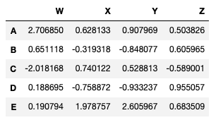  
<br/>

- Access a column via it's col-name: `df['W']` // `df[['W', 'X']]`  
- Add a column:  `df['new'] = df['W'] * 4 + df['X']`  
- Remove a column: `df.drop('new', axis = 1, inplace = True)` - w/o 'inplace = T' the col is only deleted temporarily  
- Remove a row: `df.drop('E', axis = 0, inplace = True)`   
- Select a row: `df.loc['A']` // `df.iloc[0]`  
- Get a certain value in a DF:  `df.loc['B', 'Y']` // `df.iloc[1, 2]`    
- Get a subset from a DF: `df.loc[['A', 'B'], ['W', 'Y']]` // `df.iloc[[1, 2], [3, 4]]`  
- **With .iloc - as always ROWS -> COLS**  

### 5.3 DataFrames II  
- Conditional selection: `df > 0` -> Returns a DF that has True/ False in each cell  
- Get the DF with values > 0 in 'W': `df[df['W'] > 0]`  
- Get the columns 'X' & 'Y' in the DF with values > 0 in 'W': `df[df['W'] > 0][['X', 'Y']]`  
- Multiple conditions must be combined with '()': `df[(df['W']>0) & (df['Y'] > 1)]` // `df[(df['W']>0) | (df['Y'] > 1)]`   
<br/>

- Resetting the index: `df.reset_index()` - current index as column 'index' + new index with 0, 1, 2, ...  
- Use a existing column as index: `df.set_index('X', inplace = T)`  

### 5.4 DataFrames III  
Multi-Index und Index Hierarchie - creation of multi-index:  
```
außen      = ['G1','G1','G1','G2','G2','G2']
innen      = [1,2,3,1,2,3]
hier_index = list(zip(außen,innen))
hier_index = pd.MultiIndex.from_tuples(hier_index)  
df         = pd.DataFrame(np.random.randn(6,2), index = hier_index, columns = ['A','B'])
```
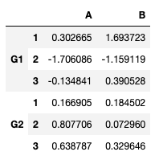   

- Assign index names: `df.index.names = ['Gruppe','Num']` --> G1 & G2 have index-name 'Gruppe' & 1,2,3 'Num'  
- Access values: 
    - `df.loc['G1'].loc[1]` --> return index '1' for the in 'G1'    
    - `df.xs('G1')` # --> Return 'G1' values  
    - `df.xs(['G1', 1])` --> return index '1' for the in 'G1'   
    - `df.xs(1, level = "Num")` --> Return the rows with '1' in index 'Num'  
  

### 5.5 Missing Data  
Common issue due to technical issues, motivation, ...   
```
df = pd.DataFrame({'A':[1,2,np.nan],
                  'B':[5,np.nan,np.nan],
                  'C':[1,2,3]})
```
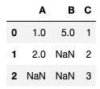  

- Remove missing values:  
    - `df.dropna()` --> Only keep rows w/o any NA's
    - `df.dropna(axis=1)` --> Only keep cols w/o any NA's  
    - `df.dropna(thresh=2)` --> Only drop rows with >= 2 NA's  

- Imputation:  
    - `df.fillna(value='Füllwert')` --> fill missing values with 'Füllwert' *(analog with any other value)*  
    - `df['A'].fillna(value=df['A'].mean())` --> Fill the missing values in 'A' with it's average  
  
### 5.6 Group By  
```
data = {'Firma':['GOOG','GOOG','MSFT','MSFT','FB','FB'],
       'Person':['Sam','Charlie','Amy','Vanessa','Carl','Sarah'],
       'Sales':[200,120,340,124,243,350]}
df = pd.DataFrame(data)
```
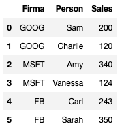  

Use group-by to apply functions *(sum, mean, ..)* for sub-groups in the data *(e.g. 'Firma')*

`df.groupby('Firma').mean()` --> Get the mean-sale value for each company *(analog for sum, std, min, max, count, describe, ...)*  
    - 'describe' equals 'summary' in R & returns min, 25%, ..., max  
    - 'groupby' groups the data by a column & applies the calculations to the sub-groups seperatly  

### 5.7 Merge, Join, Concatenate
Data Frames zusammenzuführen:  

#### Concat  

- Merge DF's on their columns/ rows  
- `pd.concat([df1,df2,df3])` merges the data column-wise *(based on colnames)*    
- `pd.concat([df1,df2,df3], axis = 1)` merges the data row-wise *(based on row-names - non matching row-names are filled with NA)*  

#### Merge
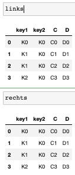  
- Merge DF's based on matching values in a given column  
- `pd.merge(links,rechts,how='inner',on='key1')` merges the DFs row-wise based on matching values in the column 'key' in both DFs - non matching rows are filled with NaN  
- `pd.merge(links, rechts, on=['key1', 'key2'])` merges the DFs row-wise based on matching values in their columns 'key1' & 'key2' - non matching rows are not part of the DF!  
- `pd.merge(links, rechts, how = 'outer', on=['key1', 'key2'])` merges the DFs row-wise based on matching values in their columns 'key1' & 'key2' - non matching rows are still part of the DF but filled with NaN  
- `pd.merge(links, rechts, how = 'right', on=['key1', 'key2'])` use all rows in 'rechts' and adds only matching rows from 'links' to it based on key1 & key2  
- `pd.merge(links, rechts, how = 'left', on=['key1', 'key2'])` use all rows in 'links' and adds only matching rows from 'rechts' to it based on key1 & key2    

#### Join  
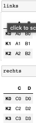  
- Row-Wise binding of DFs  
- `links.join(rechts)` use the DF 'links' and merge all columns from 'rechts' that match in the row-names - rows in 'links' unmatchable with right have NaN in new columns  
- `links.join(rechts, how = 'outer')` bind the DF's row-wise - all non matching rows from 'links'/ 'rechts' are filled with NaN

### 5.8 Operations  
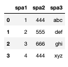  

#### Unique Values  
- Unique values in a col: `df['spa2'].unique()`  
- Amount of unique values in a col: `df['spa2'].nunique()`   
- Get frequencies of unique values in a col: `df['spa2'].value_counts()`  

#### Select data
`newdf = df[(df['spa1']>2) & (df['spa2']==444)]` - only keep rows that full-fil both conditions - single conditions must be in brackets!  

#### Apply functions  
- Define a function: `def mal2(x): return x*2`   
- Apply it to each value of a col: `df['spa1'].apply(mal2)` // `df['spa3'].apply(len)`   
- Get sum over whole column: `df['spa1'].sum()`  

#### Col & Index functions  
- Remove a column: `del df["spa1"]`  
- Get col-names: `df.columns`  
- Get row-names: `df.index`  
- Order a DF by a given column: `df.sort_values(by='spa2')`  

#### NullValues
- Check each row for NaN's: `df.isnull()`  
- Remove rows with at least a missing value: `df.dropna()`   
- Fill missing values with 'FILL': `df.fillna('FILL')`  

#### Pivotieren  
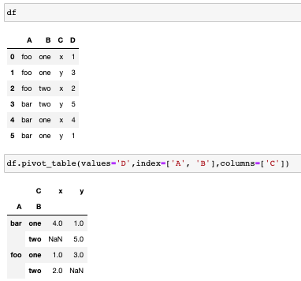   
- Use the columns 'A' & 'B' as columns, 'C' as values for columns & values itself from 'D'  

### 5.9 Exercise - Pandas
- Corresponding JupyterNotebook with own solutions: 'Python_für_Finanzanalysen/code/03-Pandas/09-Pandas_Uebung_Aufgabe.ipynb'       
- Solutions from the course in: 'Python_für_Finanzanalysen/code/03-Pandas/10-Pandas_Uebung_Loesung.ipynb'         

<br/>
<br/>

# (6) MatplotLib
Introduction to visualisations with MatplotLib & Pandas.  

### 6.1 Matplotlib I + II + III  
Library for 2- & 3-D graphics - import of the package as `import matplotlib.pyplot as plt`.  

#### Regular Plot
```
x = [1, 2, 3, 4, 5]
y = x**2
plt.plot(x, y)    # Plot x vs. y as line-diagramm
plt.xlabel("lol") # Add x-lab
plt.ylabel("xD")  # Add y-lab
plt.title("rofl") # Add a title
plt.plot()        # Plot the object
```
#### Subplots
```
# plt.subplot(AmountOfRows, AmountOfCols, PlotNr)
plt.subplot(1,2,1)    # Start with the 1. plot in [1x2 plot]
plt.plot(x, y, 'r--') # x vs y as linechart in reg 
plt.subplot(1,2,2)    # Select the next plot in [1x2 plot]
plt.plot(y, x, 'g*-') # Plot y vs x as linechart in green
plt.show()
```

#### Object Oriented
```
af = plt.figure()                        # Empty WorkingSpace to plot into  
axes = af.add_axes([0.1, 0.1, 0.8, 0.8]) # inks, unten, breite, höhe in [0 & 1]
axes.plot(x, y, 'b')                     # Plot x vs y in blue   
axes.set_xlabel('X Label definieren')    # Add x and y-axis lab
axes.set_ylabel('Y Label definieren')
axes.set_title('Titer definieren')       # Add a title
```

#### Object Oriented - Plot in Plot  
```
af    = plt.figure()                      # Empty WorkingSpace to plot into  
axes1 = af.add_axes([0.1, 0.1, 0.8, 0.8]) # Main Axis
axes2 = af.add_axes([0.2, 0.5, 0.4, 0.3]) # Next Axis - changing values here will replace the smaller plot within the bigger one  

# Create the first bigger plot around 'axes1'
axes1.plot(x, y, 'b')
axes1.set_xlabel('x Beschriftung Achse 1')
axes1.set_ylabel('y Beschriftung Achse 1')
axes1.set_title('Großes Diagramm')

# Create the first bigger plot around 'axes2'
axes2.plot(y, x, 'r')
axes2.set_xlabel('x Beschriftung Achse 2')
axes2.set_ylabel('y Beschriftung Achse 2')
axes2.set_title('Eingesetztes Diagramm')

af.show()
```

#### Subplots
```
# Create a layout for two plots in 1 row & 2 cols  
diag, axes = plt.subplots(nrows = 1, ncols = 2) 

# Plot data into the layout
for ax in axes:
    ax.plot(x, y)

# Access single plots
axes[0].plot(x, y) 

# Add more Information to the plots with:
- '.set_xlabel("x lab")'
- '.set_ylabel("y lab")'
- '.set_title("title")'
```

#### Size of plots
```
diag = plt.figure(figsize=(8,4),  # Height & Width of plot
                  dpi= 100)       # Pixel per inch (aka resolution)  

ax = diag.add_axes([0,0,1,1])     # Create the actual plot
ax.plot(x,y)
```

#### Safe Plots
```
diag.savefig("filename.jpeg", # Path and name 
             dpi = 200)       # Resolution
```

#### Add Legends  
```
diag = plt.figure()
ax   = diag.add_axes([0,0,1,1])

ax.plot(x, x**2, label="x**2") # Add LinePlot x vs x^2 and add a label
ax.plot(x, x**3, label="x**3") # Add LinePlot x vs x^3 and add a label
ax.legend(loc = 1)             # Position of the legend
```

#### Colours 
**MatLab Style**  
```
diag, ax = plt.subplots()
ax.plot(x, x**2, 'b.-') # blaue Linie mit Punkten
ax.plot(x, x**3, 'g--') # grüne gestrichelte Linie
```

**ColorParameter**  
```
diag, ax = plt.subplots()

ax.plot(x, x+1, color="blue", alpha=0.5) # Transparancy = 50%
ax.plot(x, x+2, color="#8B008B")         # RGB Hex Code
ax.plot(x, x+3, color="#FF8C00")         # RGB Hex Code 
```

#### Linetypes  
- Line strength with `linewidth` / `lw`  
- Line style with `linestyle` / `ls` 

```
diag, ax = plt.subplots(figsize=(12,6))

# Different LineWidths
ax.plot(x, x+1, color="red", linewidth=0.25)
ax.plot(x, x+2, color="red", linewidth=0.50)
ax.plot(x, x+3, color="red", linewidth=1.00)
ax.plot(x, x+4, color="red", linewidth=2.00)

# Different LineStyles (‘-‘, ‘–’, ‘-.’, ‘:’, ‘steps')
ax.plot(x, x+5, color="green", lw=3, linestyle='-')
ax.plot(x, x+6, color="green", lw=3, ls='-.')
ax.plot(x, x+7, color="green", lw=3, ls=':')

# Different Marker ('+', 'o', '*', 's', ',', '.', '1', '2', '3', '4', ...)  
ax.plot(x, x+ 9, color="blue", lw=3, ls='-', marker='+')
ax.plot(x, x+10, color="blue", lw=3, ls='--', marker='o')
ax.plot(x, x+11, color="blue", lw=3, ls='-', marker='s')
ax.plot(x, x+12, color="blue", lw=3, ls='--', marker='1')

# Different Marker Size & Colors 
ax.plot(x, x+13, color="purple", lw=1, ls='-', marker='o', markersize=2)
ax.plot(x, x+14, color="purple", lw=1, ls='-', marker='o', markersize=4)
ax.plot(x, x+15, color="purple", lw=1, ls='-', marker='o', markersize=8, markerfacecolor="red")
ax.plot(x, x+16, color="purple", lw=1, ls='-', marker='s', markersize=8, markerfacecolor="yellow", markeredgewidth=3, markeredgecolor="green");
```

#### Range of values  
```
diag, axes = plt.subplots(1, 3, figsize=(12, 4))

axes[0].plot(x, x**2, x, x**3)
axes[0].set_title("Standard Achsen")

axes[1].plot(x, x**2, x, x**3)
axes[1].axis('tight')
axes[1].set_title("Enge Achsen")

axes[2].plot(x, x**2, x, x**3)
axes[2].set_ylim([0, 60])  # Set the value are manually
axes[2].set_xlim([2, 5])    
axes[2].set_title("Benutzerdefiniert")
```

#### Special Diagramms  
Special diagramms you should know exist - details can be looked up if needed:  

- ScatterPlot: `plt.scatter(x,y)`  
- Histogram: `plt.hist(data)`  
- BoxPlot: `plt.boxplot(data, vert = True, patch_artist = True)`

### 6.2 Exercise - MatplotLib  
- Corresponding JupyterNotebook with own solutions: 'Python_für_Finanzanalysen/code/04_Visualisierungen_mit_Matplotlib_und_Pandas/2-Matplotlib_Uebung-Aufgabe.ipynb'       
- Solutions from the course in: 'Python_für_Finanzanalysen/code/04_Visualisierungen_mit_Matplotlib_und_Pandas/3-Matplotlib_Uebung-Loesung.ipynb'  

### 6.3 Pandas Vizualisation  
Integrated methods for plotting in pandas.  

- Adjsut the style of such plots with Matplotlib via `plt.style.use('ggplot')` (or 'bmh', 'dar_background', ...)   
- `df['A'].hist(bins = 50)` to create a historgram of the column 'A'     
- `df.plot.area(alpha = 1)` line diagramm with filled area for each of the columns in 'df' *(row-id = x-axis)*  
- `df.plot.bar(stacked = F)` barplot colored by each column in 'df' *(row-id = x-axis)*  
- `df.plot.line(x = df.index, y = 'B')` for a regular line-plot *(e.g. over time)*  
    - `lw` & `figsize` can be modified  
- `df.plot.scatter(x = 'A', y = 'B', c = 'C')` scatter plot with colors according to 'C'  
    - Size of points can also be regulated with 's' *(either fix or indivdual for each obs)*  
- `df.plot.box` do a boxplot for each column in 'df'  
- Hexagon plot *(x-y map divided into equally sized hexagons)* via `df.plot.hexbin(x = 'A', y = 'B', gridsize = 25)`  
- Kernel-Density estimation via `df['A'].plot.kde()` // `df['A'].plot.density()`  
    - 'density' can be applied to multiple columns at once  

### 6.4 Exercise - Pandas Vizualisations  
- Corresponding JupyterNotebook with own solutions: 'Python_für_Finanzanalysen/code/04_Visualisierungen_mit_Matplotlib_und_Pandas/5-Pandas_Data_Visualization_Uebung-Aufgabe.ipynb'         
- Solutions from the course in: 'Python_für_Finanzanalysen/code/04_Visualisierungen_mit_Matplotlib_und_Pandas/6-Pandas_Data_Visualization_Uebung-Loesung.ipynb'           

<br/>
<br/>

# (7) Data sources  
Financial data can be accessed via 'Pandas-DataReader' *(use API's to get the relevant data)* or 'Quandl' *(up to 50 requests per day for free)*.  
For exercises the data is also supplied as '.csv', ...  
Install following packages into your enviroment: `conda install sqlalchemy`, `conda install lxml`, `conda install html5lib` & `conda install BeautifulSoup4`  

### 7.1 CSV  
`pwd` to get the current python working directory.  
- `df = pd.read_csv('example.csv')` uses first row as header and adds a row-index automatically  
- `df.to_csv('saved.csv')` to save a csv *(by default inclusive the row-index)*  

### 7.2 Excel  
- `df = pd.read_excel('Excel_Sample.xlsx', sheetname = 'Sheet1')` to read in the 'Sheet1' of the file  
- `df.to_excel("My_Excel.xlsx", sheetname = 'Shieeet1')`  

### 7.3 HTML  
- `df = pd.read_html('http://www.fdic.gov/ban/individual/failedd/banlist.html')` reads all tables from the link and safes them into a list  

### 7.4 SQL  
- Different data SQL-banks *(Postgres, MySQL, Oracle, ...)* that all need an own 'connector'  
```
from sqlalchemy import create_engine
engine = create_engine('sqlite:///:memory:')  

df.to_sqwl("Daten", engine)             # To save data into a SQL-Engine
df = pd.read_sql("Daten", con = engine) # To read in a file from a SQL-Engine  
```

### 7.5 JSON
- JSON-object consists of key-value pairs and is commonly used - after the loading it has the type 'dict'.  
- To create a dataframe from the dictionary: `df = DataFrame(data['diet'])`  

### 7.6 YFINANCE  
Package to get the stock-data
```
import datetime as dt
import yfinance as yf

company = 'aapl'
start   = dt.datetime(2020,1,1)
end     = dt.datetime(2022,1,1)

data = yf.download(company, start , end)
data.tail(10)
```  

### 7.7 NasdaqDatalink
```
import nasdaqdatalink
mydata = nasdaqdatalink.get("FRED/GDP")
```

<br/>
<br/>

# (8) Pandas & DataSeries

### 8.1 Intro
TimeSeries are a special type of data over time that need speical functions & methods

### 8.2 DateTimeIndex
- DateTime is mostly used as index and not in a seperate column  
- `datetime.datetime(year, month, day)` to create a date
- `datetime.datetime(year, month, day, hour, minute, second)` to create a date-time  
- The date/ date-time elements have own methods *(e.g. hour, timezone, ...)*  
- We can set a time as index in a pd-DF with: `pd.DatetimeIndex(DateTimeList)`  

```
# Create a DF with date-time index
data       = [1, 2, 3, 4]
data_index = [datetime.datetime(2023, 1, 1), datetime.datetime(2023, 1, 2)]
col_names  = ['Col1', 'Col2']
df         = pd.DataFrame(data, data_index, col_names)

# DF has 2 columns 'Col1' & 'Col2' + 1.1.2023 & 2.1.2023 as index values

df.index.max()    # --> to get the max value of the index
df.index.argmax() # --> get the index of the max index
```

## 8.3 TimeResampling aka Wiederholte Stichproben
- Useful to aggregate dates by e.g. months, quartals, ... 
- `df.info()` to get the datatypes of all columns *(as 'str' in R)* 
- Convert str into date: `pd.to_datetime(df['Date'], format = "%d-%m-%Y")`  
- Set a column as index: `df.set_index('ColName', inplace = T)`
- `df.resample(rule = "Q")` slice the data into its quartals and then get their mean/ max/ ... `df.resample(rule = "Q").mean()`
    - 'A' for yearly results
    - 'Q' for quarterly results
    - 'BQ' for business quartals

## 8.4 Time-Shifting
- Sometimes dates have to be shifted into the future/ past
- `df.shift(1)` move all values down by 1 row
- `df.shift(-1)` move all values up by 1 row
- `df.tshift(periods = 1, freq = 'A')` shift all dates in the index by 1 month  

## 8.5 Rolling and Expanding  
- Calculate a rolling mean, max, ... all in the time-area of e.g. 7 days
- `df.rolling(7).mean()` to calculate the mean over a span of 7 days
```
df['Open_Mean'] = df.rolling(window = 7).mean()

# Plot both lines - 'Open_Mean' is the moving average and much smoother!
df[['Open', 'Open_Mean']].plot(figsize = (16, 6))
```
- `df['Close'].expanding(min = periods = 1).mean()` to get the mean values from start to each time-point!  

## 8.6 Bollinger Bands
- Volitity-Bands that are placed to a moving average and depend on the standard deviation of the data
- Bands get wider, when the standard deviation of the data gets bigger y vic versa  
- Bands cover ~99% of all prices -> cheap prices, when the curse is below a BollingerBand & expensive, when it's above
```
# 20-Day-Moving-Average
df['20_day_mean'] = df['Close'].rolling(window=20).mean()
df['Upper']       = df['20_day_mean'] + 2 * df['Close'].rolling(window=20).std()
df['Lower']       = df['20_day_mean'] - 2 * df['Close'].rolling(window=20).std()

df[['20_day_mean', 'Upper', 'Lower']].plot()
```

# (9) Stock-Analysis Project
- Corresponding JupyterNotebook with own solutions: 'Python_für_Finanzanalysen/code/07-Aktienmarkt-analyseprojekt/Aktienanalyse_Projekt-Aufgabe.ipynb'         
- Solutions from the course in: 'Python_für_Finanzanalysen/code/07-Aktienmarkt-analyseprojekt/Aktienanalyse_Projekt-Loesung.ipynb'   

<br/>
<br/>

# (10) Time-Series
## 10.1 Basics 
Time-Series can have:  
- an up-, down- or stationary-**Trend**  
- have **Saisonalities** *(e.g. amount of snowboard google-queries)*  
- **Cycles** - Saisonalities without fix repetitions  

## 10.2 StatsModels
- Library for various functions for time-series in Python
- `conda install statsmodels` - details & examples on 'statsmodels.org'
- Load GDP-data of USA with the package & plot it over time
- Calculate the trend & cyclus with 'statsmodels' *('hpfilter', but many more possible)* -> plot this estimation against the real gdp  

## 10.3 ETS
- Decompose your time-series into **Trends**, **Seasonality** & **Residuals**
- Error-Trend-Seasonality models with:
    - Exponentail Smnoothing
    - Error-Trend-Seasonality decompostion *(e.g. amount of passengeres over time)*  
        - Decompose the passengers over time into trend, seasonal-trends & residuals   
- Examples in 'code/08-Zeitreihenanalyse/3-ETS-Dekomposition.ipynb'

## 10.4 EWMA
- SMA *(Simple Moving Average)* is the moving average over the last x-days
    - the smaller the time-window the more noise
    - no values for the first x-days
    - calculation of the average --> will never be at the max/ min of the true time-series
    - can only describe trends, but not predict future values
    - extrem values have a huge impact  
- EMWA *(exponential weighted moving average)* aims to solve some of the issues with SMA
    - Get estimations for all data-points + put more focus to new values *(old data points have less relevance)*
    - Call via: `vector.ewm(span=12).mean()`
    - Details in 'code/08-Zeitreihenanalyse/2-EWMA-Exponentially-weighted-moving-average.ipynb'
        - Put more weights on the relevant data-points *(smaller weight the older)*
        - The more far away a time-point from now, the lower its weight
        - Value alpha can either be defined manually *(0 - 1)* or either be defined as span, center of mass, half-life, ... *(details in .ipynb)*  

## 10.5 ARIMA
- Essential to understand time-series analysis, but not made for historic stock data  
- ARIMA = AutoRegressive Integrated Moving Average && ARMA = AutoRegressive Moving Average  
- Designed to predict future development & understanding the data in general  
- ARIMA have seasonal & non-seasonal models  
- Stationary vs. non-stationary
    - What makes data stationary? It has a constant mean, sd & cvoariance over time!
    - If data has seasonailtiy they are not stationary  
    - You can also apply a mathematical test: Augmented Dickey-Fuller Test

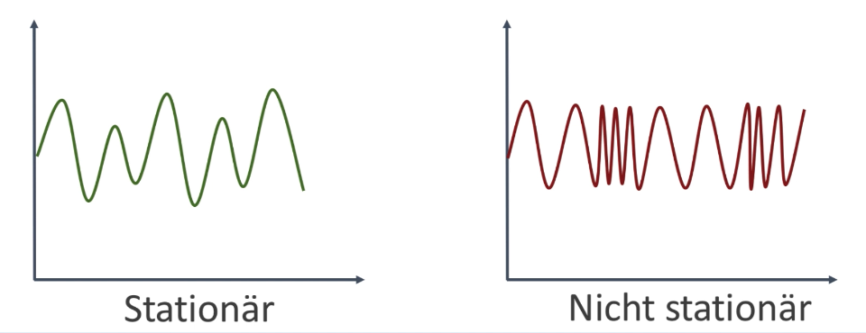
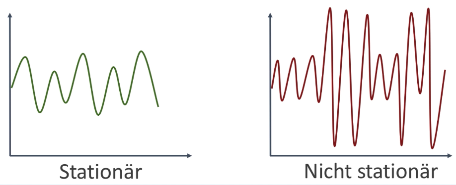  
- Non-Stationary data has to be converted to stationary data before ARIMA can be applied
- Differentiation: Substract the next x values from t_i and replace it *(single, double, ...)* to convert to stationary data  

## 10.6 Autocorrellationdiagramm (ACF)
- Shows the correlation of a time-series with it self delayed by x time-units *(x = Amount of delayed units, y = Correlation)*  
- Copy the time-series twice and delete first element of list1 + last element pf list 2 & calculate the correlation then  
    - x-Value = 1 & y-Value is the corresponding correlation *(gradual decline, sharp drop-off, ...)*  
- Deciding whether we should use AR or MA terms? --> Sign of the first autocorrelation  
- Recommendations for the setting of arguments of ARIMA:  
    - p: Amount of Lag-Observations in the model
    - d: Amount of raw-Obersationvs we need to differentiate 
    - q: Window size of the moving average

## 10.7 Arima Code
- All code in 'code/08-Zeitreihenanalyse/4-ARIMA-und-Saisonale-ARIMA.ipynb' - examples for the whole chapter   
- Process a data-set, inspect it *(moving average & sd)* and decompose it into trend & seasonality 
- Check for stationarity, convert to non-stationary *(in different ways)* - needed to identify the the correct ARIMA model to use   
- Applying the ARIMA Model, check residuals & get predicitons    
- Book to Arima: https://people.duke.edu/~rnau/arimrule.htm  

<br/>
<br/>

# (11) Python Finance-Basics  

## 11.1 Sharp-Ratio
- Portfolio: Collection of ETFs, Stocks, ...  
- RETURN:
    - Daily Return: Gain per day & stock   
    - Cumulative Return: Gain over time *(e.g. holding-time)*  
    - Average daily return: Average of the daily returns over time-span  
    - SD(Average daily return)  
- Sharp Ratio:  
    - How to judge a portfolio - not only on overall return, but also with its variance   
    - SR: > 1 good, > 2 very good, > 3 incredibly good  
    - SHARP-RATIO: compares the return of an investment with its risk   
        - Risk-free Rate: Return you get for no-risk invenstments *(interst in a bank, Government bond, ...)*  
        - Expected Return: Expected/ real portfolio-return *(calculated via [mean average daily return])*   
        - To get the annual sharp ratio, we need the multiplication with a k-Factor:  
            - Daily: ASR = sqrt(252) * SR  
            - Weekly: ASR = sqtr(52) * SR  
            - Monthly: ASR = sqrt(12) * SR  
  

## 11.2 Sharp-Ratio & portfolio allocation exercise  
- Exercise in: 'code/09-Python-Finanzgrundlagen/01-Portfolio-Allokation-und-Sharpe-Quotient.ipynb'  
- Create a portfolio of different stocks and different weighting  
- Get the stocks cummulative returns
- Overall portfolio performance incl. plot w/ / w/o single stocks of portfolio  
- Get portfolio statistics *(daily return, total return, average daily return and sd of daily return)*  
- Sharp-Ratio calulation  

## 11.3 Portfolio optimization
- How to optimize our portfolio?! Apply various weights to the various position and get the SHARP-Ratio  
- Do this with a Monte-Carlo-Simulation & get the SHARP-Ratio for various weightings *(optimal are the ones one the edge with maximal return)*  
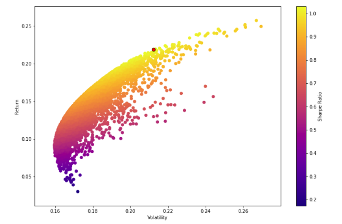  
- To find the optimal allocation, we have to mathematically optimize it *(maximize SHARP-Ratio // minimize negative SHARP-Ratio)*  

## 11.4 Portfolio optimization exercise  
- Exercise in: 'code/09-Python-Finanzgrundlagen/02-Portfolio-Optimierung.ipynb'  
- Use the portfolio and get the correlation between stocks & average return per stock  
- Arithmetic-Returns vs. Log-Returns *(has a detrending effect)*  
- Calculate the SHARP-Ratio for various courses  
- Create a Volatility-Return Plot with coloring by SHARP-Ratio  
- Mathematically optimization *(with 'scipy.optimize')*  
- Efficient Frontier *(Portfolios with the highest expected return for a given risklevel [simulate various risk-levels])*    

## 11.5 Fond-Tpyes
- ETF = Exchange Traded Funds *(Börsengehandelte Fonds)*  
    - Consist of Fonds, Stocks, Commodities, ...    
    - Public, transparent & can be bought by single persons  
    - Splitting the money to multiple stocks, ... reduces the risks     
    - 0.01 - 1% costs  
    - Buy/ Sell like a regular stock  
- Infestmentfonds  
    - Pool of fonds from multiple investors used for investments in stocks, ...  
    - For various settings *(e.g. certain areas, topics, ...)*  
    - Costs 0.5% - 3% and is activly managed  
    - Buy/ Sell at the end of the day with a broker  
- Hedgefonds  
    - Organized by a Asset Manager that invests the capital of the fond to generate earnings  
    - Manually managed!   
    - 2% on the fonds % 20% on wins  
    - Buy/ Sell depends on the contract   

## 11.6 Order books  
- Let's have a closer look on the process when a stock is sold/ bought  
    - Buy or Sell  
    - Stock symbol  
    - Amount 
    - Limit- or market-price  
    - Price *(if it's limit order)*  
- Example: Want to buy 'BAC', 200x with a limit-order of <= 199.95  
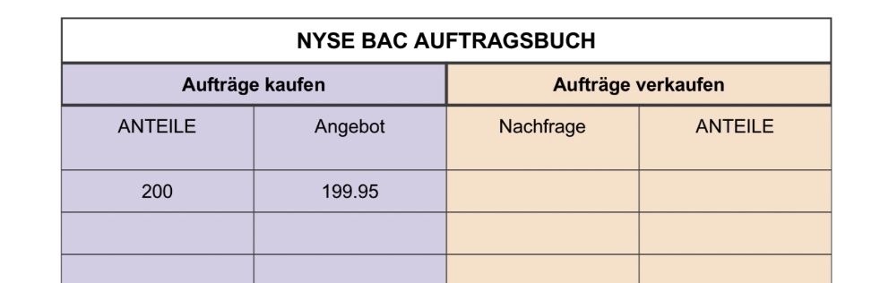   
- Need to wait now for offers with prices <= 199.95 and buy them then:  
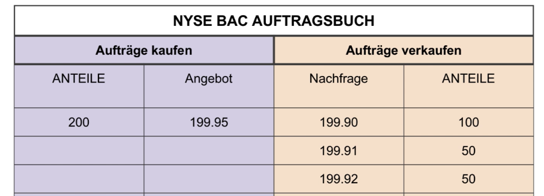
<br/>  
- High frequency trading *(HFT)*  
    - Bank wants to buy 90k of stocks and sends the info to BATS, NYSE, NASDAQ, ... 
    - Bank buys 30k stocks on BATS -> HFT sees this and buys the stock on NYSE & NASDAQ, where the price will increase if the order of the bank arrives   

## 11.7 Short Selling  
- Make profit when stocks fall  
    - X is worth 500 
    - You lend 10 stocks from Mr.Y for totally 5.000 and sell them immeaditly  
    - X is worth 400 now - buy 10 stocks for 4.000 and return them to Mr.Y  
    - You earned 1.000 by short selling 
    - High Risk + respect the OrderFees  

## 11.6 CARM -- Capital Asset Pricing Model  
- Model to distingiouish between the return of the market in general and the return of your portfolio  
- Return of a portfolio to given time-point t = Sum(i = 1; n) w_i * r_i(t)  
    - w_i weight of stock
    - r_i(t) return of stock at 't'  
- Return of the market in general is analog, BUT use the Market capitalization as weights *(w_i = MarketCap_i / sum(all MarketCaps))*  
- Relation between stock performance & market performance is correlated  
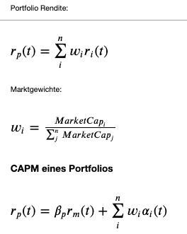  
- Corresponding code in: 'code/09-Python-Finanzgrundlagen/03-CAPM-Capital-Asset-Pricing-Model.ipynb'  
    - Compare market-performance vs. single Stock *(compare courses, overall-return, daily-returns, ...)*  
    - Estimate Alpha & Beta for the CAPM-Equation  

## 11.7 Splits & Dividens  
- StockSplits: Split the price by factor X and increase the amount of stocks by the factor X *(X > 1 --> StockSplit)*  
- Dividens: Stocks can pay dividend per hold - attention use the adjusted closing-course as it respects dividend-payouts   
- 'SurvivorShipBias': S6P500 consists of different companies now then it did in 2000  
    - Think of this when doing back-testing!  

## 11.8 Efficent Market Hypothesis  
- Asset prices reflect all available information, hence it is impossible to "beat the market" consistently on a risk-adjusted basis since market prices should only react to new information  
- If EHM is 100% true, Hedgefonds would only out-perform the market by luck...  
- EHM may not 100% true, as there were times where the market was overvalued *(dot-com, finance-cirisis, ...)*  
- We can assume that the market is not always 100% efficent!  

<br/>
<br/>

# (12) Basics of algorithmic trading  

## 12.1 Quantopia
- Quantopia offers a ecoysstem to create algorithmic trades with contest *(comparable to Kaggle)*!    
- Has integrated Jupyter Notebook to develop trading algorithms  
- Inspect various trading algorithms and backtest it  
- Was bought by RobinHood in 2021 and is now accessible via: 'https://blueshift.quantinsti.com' *(orignal Quantopian is not accessible anymore...)*   

## 12.2 Research Basics in Quantopia  
- Quantopian WebSite is down by now...  
- Offered NoteBooks *(as JupyterNotebooks)* with special functions 
    - 'get_pricing': Open, High, Low, Close, Volume, Price for each day  
    - 'symbols': Get details to a stock like AssetName, Exchange, sid *(unique ID per stock)*, symbol, ...   

## 12.3 Algorithmic Basics in Quantopian
- Create a new algorithm for trading   
- Could be back-tested with the Quantopian-WebSite  
- Exemplary Algorithm: Adjust the Depot every minute, such that each stock has the following ratio: AAPL 27%, CSCP 20%, AMZN 53%  
- Further functions: 
    - can_trade(): Is the stock trade-able  
    - current(): Is used to get the current information of a stock   
    - history(): Get historic data like price, volume ... for a stock over a certain period of time  
    - schedule_function(): Wann sollen bestimmte Funktionen ausgeführt werden *(Buy, Sell, ...)*  
    - record(): Return portfolio information per stock *(e.g. close)*  

## 12.4 Trading Algorithm  
- "PairTrading" as trading algorithm  
    - Use two highly correlated stocks > 0.9 *(e.g. two airlines)* and use the price-difference as signal, if a stock moves out of the correlation-zone  
    - Get the spread of the two stocks *(price-difference between the two stocks)* and plot it  
    - Normalize the spread *((x - mean(x)) / sd(x))*
    - Plot the normalized spread, add the mean + add upper and lower limits as buy signal *(as the correlation is out of regular range)*  
    - Instead if the regular mean, we can calculate the moving average for 1 & 30 days and normalize it then *((M_Avg1 - M_Avg30 / sd(M_Avg30)))*  
- Implementation on Quantopian  

## 12.5 Exercise  
- Bolling Bands:  
    - Calculate the 20-Day rolling mean & the 20-Day rolling SD  
    - 20-Day rolling mean +/- 20-Day rolling SD as bands   
    - Assumption is that the stock value is in between the bollinger bands in most of the time  
    - If the stock-course is above the boilling band we sell, if it's below, we buy  
- Can not be done, as Qunatopian is not availabe no more...  
- Implementation incl. back-testing & vizualisation of the bolling bands  

<br/>
<br/>  

# (13) Quantopian PipeLines  

## 13.1 PipeLines  
- Useful for algorithms that follow a fix structure - e.g.:  
    - Calc Skalarvalue for all assests  
    - Filter assests based on the Skalarvalue  
    - Define the weights for the various assests  
    - Buy stocks such that they respnd to their weight  

## 13.2 Factors  
- Klassifikator: Function to get e.g. the class of a stock, simply pass timestamp & asset  
- Factor: Function to get e.g. the 10-day moving average based on timestamp & asset   
- Exemplary implementation in Quantopian *(not availabe no more...)*  
    - Get the 30-day mean per stock  
    - Get the latest closing-price  
    - % difference between 10- & 30-day mean  
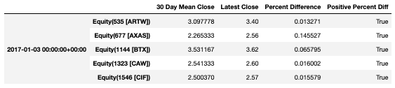   
- We can furher filter this table with 'screen = final_filter' - e.g. 'final_filter' is difference between 10- & 30-day mean  
- We can also filter before even querying the data with 'mask = small_price' - e.g. 'small_price' checks for price < 5  
- Klassifikator can be used to get meta data for the stock - e.g. trading stock  

## 13.3 Implementaion of pipeline in Quantopia  
- Practical implementation of the pipelines in Quantopia  
- Not too intereting, as we can not follow along, as Quantopia is not live no more...  
- Theoretical things are thought in chapters before  

<br/>
<br/>  

# (14) Finance with Python for advanced  

## 14.1 Leverage
- Taking a credit to invest it *(e.g. to buy a house)*  
- With algorithmic trading it means to invest debt to enlarge the profit  
    - Boost your expected profits, by enlarging your Depot with debts  
- Leverage Ratio = (Debt + Capital) / Capital  
